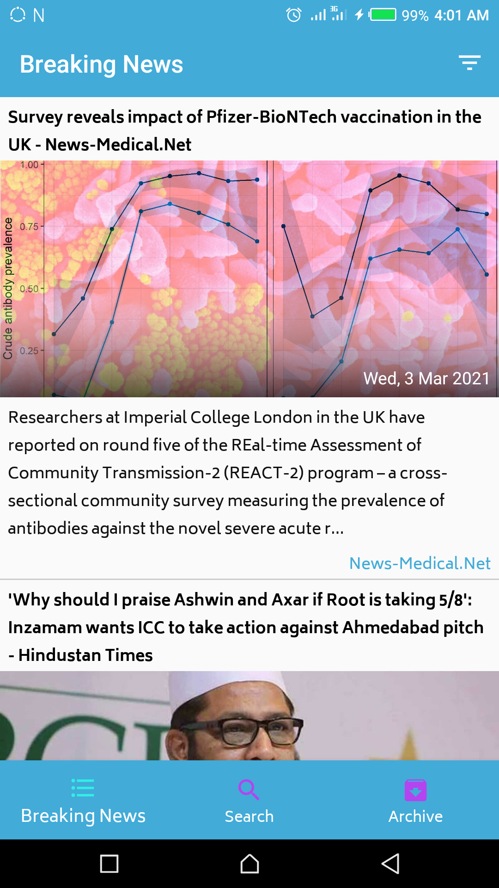
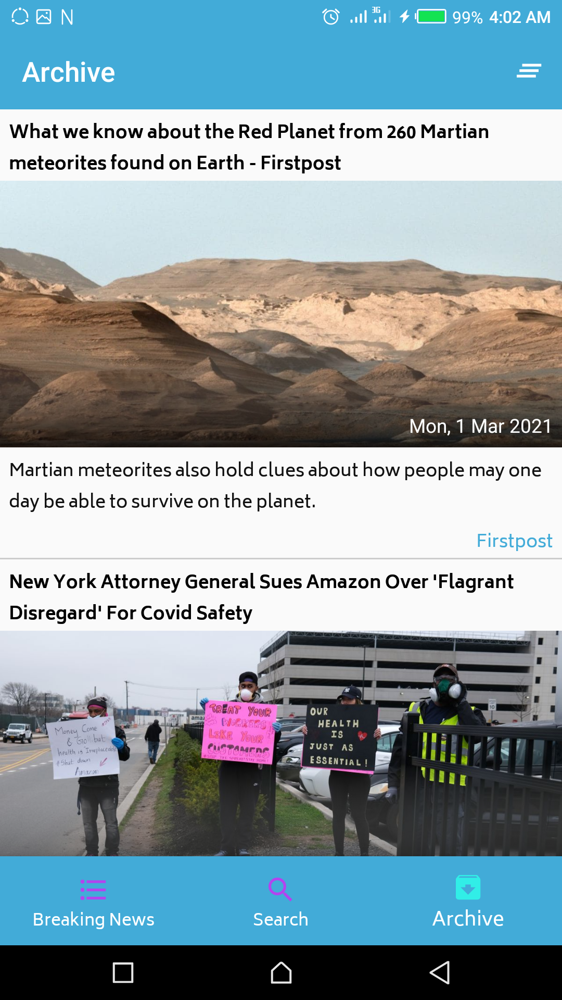

# NewsFetchr App

# Introduction
- This is a Simple News app with very minimal design

# Features
- Retrieve News Headlines from around the world
- Search for News from around the world
- News Headlines can be saved for offline view
- Can change Country and Category for news report
- Swipe to delete feature for saved News Headlines
- Click to read full News Article
- Pagination

# Download App

<a href="app/release/app-release.apk">Download NewsFetchr</a>

# Screenshots
|Breaking News|Search News|
|---|---|
|||
|Archive News|Full Article|
|---|---|
|||

# Tools and Architecture
- MVVM(Model View ViewModel)
- Room
- Retrofit
- Coroutines
- Navigation Graph

# Contact 
- Email : henryudorji@gmail.com.</b>
- Twitter: @henry_ifechukwu

# Api Provider 
- newsapi.org

# Setup
- visit the site https://newsapi.org to generate your api key, use the generated api key instead of mine

# Bugs
- Feel free to fork this project and fix bugs.